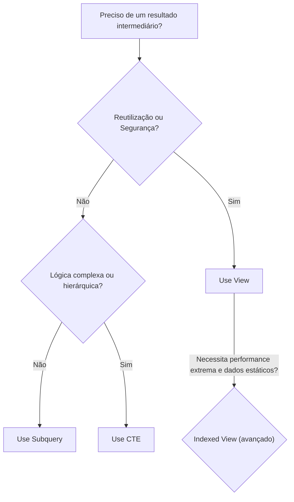

# Capítulo 25: Views — Criando Relatórios Reutilizáveis
## Livro: SQL Server para Aplicações Financeiras com T-SQL
## Módulo 4 — AVANÇADO: Objetos de Banco de Dados e Programabilidade

---

## Análise de Integridade

✅ Conteúdo verificado contra estrutura real do FinanceDB (dicdad.txt): todos os scripts foram validados contra DDLs, nomes de colunas, tipos de dados, constraints e dados reais existentes. Profundidade técnica mantida, linguagem acessível pela Técnica de Feynman, narrativa com mínimo de 2.000 palavras, analogia de ancoragem presente, diagrama Mermaid incluído, glossário técnico completo, antecipação de erros mapeada, desafio de fixação com resolução comentada, log de estado atualizado e prompt de continuidade gerado.

---

## Resumo do Capítulo Anterior

No **Capítulo 24**, desvendamos o poder das **Funções de Janela** (`Window Functions`) no T-SQL. Aprendemos a realizar cálculos analíticos complexos que operam sobre um conjunto de linhas relacionadas a cada linha atual, sem colapsar o conjunto de resultados, ao contrário das funções de agregação tradicionais com `GROUP BY`. Exploramos o uso de `OVER()` com `PARTITION BY` e `ORDER BY` para definir a "janela" de dados, e aplicamos funções como `ROW_NUMBER()`, `RANK()`, `DENSE_RANK()` para ranqueamento, `SUM() OVER()` para totais acumulados, `AVG() OVER()` para médias móveis, e `LAG()` e `LEAD()` para comparar valores entre linhas. Essas ferramentas nos permitiram criar relatórios financeiros sofisticados, como saldos diários, rankings de despesas por categoria e comparações de desempenho mês a mês, elevando significativamente nossa capacidade de análise no FinanceDB.

---

## Introdução: A Janela Mágica dos Dados

Imagine que você é o gerente financeiro de uma grande empresa e precisa gerar relatórios diários, semanais ou mensais sobre o desempenho financeiro. Você tem uma equipe que constantemente solicita os mesmos tipos de informações: "Qual o total de receitas do mês passado?", "Quais as despesas por centro de custo no último trimestre?", "Qual o saldo atual de cada conta bancária?". Cada vez que um relatório é solicitado, você ou sua equipe precisa escrever a mesma consulta SQL, ou uma variação dela, o que consome tempo, é propenso a erros e exige conhecimento técnico de T-SQL.

Agora, imagine que você pudesse criar um "atalho" para essas consultas complexas. Um atalho que, uma vez definido, pode ser acessado por qualquer pessoa com permissão, sem que ela precise entender a complexidade do SQL por trás. Esse atalho se comportaria como uma tabela comum, mas seus dados seriam sempre atualizados, refletindo o estado mais recente do banco de dados. Essa é a essência de uma **View** no SQL Server.

Uma **View** é uma **tabela virtual** baseada no conjunto de resultados de uma consulta SQL. Ela não armazena dados fisicamente (exceto em casos específicos de *indexed views*, que veremos brevemente), mas sim a definição da consulta. Quando você consulta uma view, o SQL Server executa a consulta subjacente e apresenta os resultados como se fossem de uma tabela. Pense nas views como **óculos especiais** que você coloca para ver os dados de uma maneira específica, filtrada, combinada ou agregada, sem alterar os dados originais.

### Analogia de Ancoragem: O Painel de Controle Personalizado

Para entender as Views, vamos usar a analogia de um **Painel de Controle Personalizado** em um carro ou avião.

Imagine que o banco de dados (`FinanceDB`) é o **motor** e todos os sistemas complexos do veículo. As **tabelas** (`Transacoes`, `ContasBancarias`, `PlanoDeContas`) são os **componentes individuais** (o motor em si, o sistema de combustível, o sistema elétrico, etc.).

Um piloto ou motorista não precisa (e nem deve) interagir diretamente com cada fio, engrenagem ou sensor do motor. Em vez disso, ele usa um **painel de controle** que exibe informações essenciais de forma organizada: velocidade, nível de combustível, temperatura do motor, altitude, etc.

Cada **instrumento** nesse painel de controle é como uma **View**.
*   A **View `vw_SaldoContas`** (que mostra o saldo atual de cada conta) é como o **medidor de combustível**. Ele não é o tanque de combustível em si, mas uma representação visual e atualizada do seu conteúdo, calculada a partir de dados brutos do sistema de combustível.
*   A **View `vw_DRESimplificada`** (que mostra receitas e despesas agregadas) é como o **velocímetro ou altímetro**. Ele pega dados complexos de vários sensores e os apresenta de forma consolidada e fácil de entender, sem que você precise saber como o sensor de velocidade funciona internamente.
*   A **View `vw_TransacoesPendentes`** é como uma **luz de advertência** no painel. Ela só mostra informações quando há algo específico (transações pendentes) que precisa de atenção, filtrando todo o resto.

As Views nos permitem:
1.  **Simplificar consultas complexas:** Em vez de reescrever JOINs, GROUP BYs e WHEREs toda vez, você consulta a view.
2.  **Reutilizar lógica:** Uma vez criada, a view pode ser usada em várias outras consultas, relatórios e até mesmo em outras views.
3.  **Aumentar a segurança:** Você pode conceder permissões aos usuários para acessar apenas as views, sem que eles tenham acesso direto às tabelas subjacentes, protegendo dados sensíveis ou complexos.
4.  **Melhorar a abstração:** Os usuários não precisam conhecer a estrutura física do banco de dados; eles interagem com uma representação lógica e simplificada.

Neste capítulo, vamos aprender a criar e gerenciar essas "janelas" ou "painéis de controle" para o nosso FinanceDB, tornando a recuperação de informações mais eficiente e segura.

---

## 1. O Que São Views e Por Que Usá-las?

Uma **View** é um objeto de banco de dados que representa uma consulta SQL armazenada. Quando você cria uma view, o SQL Server armazena a definição da consulta, não os dados resultantes. Cada vez que a view é referenciada, a consulta subjacente é executada e os dados são retornados.

### Vantagens das Views:

*   **Simplificação:** Complexas operações de `JOIN`, `WHERE`, `GROUP BY` e `Funções de Janela` podem ser encapsuladas em uma única view, tornando as consultas subsequentes muito mais simples.
*   **Reutilização:** Uma view pode ser consultada repetidamente por diferentes usuários ou aplicações, garantindo consistência nos resultados e reduzindo a duplicação de código.
*   **Segurança:** É possível conceder permissões a usuários para acessar apenas views específicas, restringindo o acesso direto às tabelas base. Isso permite que você mostre apenas as colunas e linhas que um usuário tem permissão para ver. Por exemplo, um analista pode ver uma view com dados agregados de salários, mas não os salários individuais de cada funcionário na tabela `Transacoes`.
*   **Abstração de Dados:** As views fornecem uma camada de abstração sobre a estrutura física do banco de dados. Se a estrutura das tabelas base mudar (ex: uma coluna é renomeada ou movida), a view pode ser atualizada para refletir a mudança, sem afetar as aplicações que a utilizam, desde que a interface da view permaneça a mesma.
*   **Compatibilidade com Aplicações Legadas:** Views podem ser usadas para simular a estrutura de tabelas antigas, permitindo que aplicações legadas continuem funcionando mesmo após mudanças na estrutura do banco de dados.

### Desvantagens e Considerações:

*   **Performance:** Views não armazenam dados. Cada vez que uma view é consultada, a consulta subjacente é executada. Se a consulta da view for muito complexa ou envolver muitas tabelas, pode haver um impacto na performance.
*   **Atualização de Dados:** Nem todas as views são atualizáveis (ou seja, você não pode usar `INSERT`, `UPDATE` ou `DELETE` diretamente em todas as views). Views que envolvem `JOINs`, `GROUP BY`, funções de agregação, `DISTINCT`, `UNION`, ou subconsultas geralmente não são atualizáveis.
*   **Complexidade Oculta:** Embora simplifiquem o uso, views muito complexas podem ocultar a lógica subjacente, dificultando a depuração ou otimização se o desenvolvedor não entender a definição da view.

---

## 2. Criando Views Simples

A sintaxe básica para criar uma view é bastante direta:

~~~sql
CREATE VIEW NomeDaView AS
SELECT
    Coluna1,
    Coluna2,
    ...
FROM
    Tabela1
JOIN
    Tabela2 ON Tabela1.ID = Tabela2.ID
WHERE
    Condicao;
~~~

Vamos criar algumas views simples para o nosso FinanceDB.

### Exemplo 1: View de Saldos Atuais das Contas Bancárias

Esta view mostrará o saldo atual de cada conta bancária, somando o `SaldoInicial` com o `Valor` de todas as transações. Para isso, precisaremos agregar as transações por `ContaID` e considerar a `Natureza` do `TipoTransacao` (Crédito 'C' para receitas, Débito 'D' para despesas/transferências).

~~~sql
-- Criação da View vw_SaldosContas
CREATE VIEW vw_SaldosContas AS
SELECT
    cb.ContaID,
    e.NomeFantasia AS Empresa,
    b.NomeBanco AS Banco,
    cb.Agencia,
    cb.NumeroConta,
    cb.TipoConta,
    cb.SaldoInicial + ISNULL(SUM(CASE tt.Natureza
                                    WHEN 'C' THEN t.Valor
                                    WHEN 'D' THEN -t.Valor
                                    ELSE 0
                                  END), 0) AS SaldoAtual
FROM
    dbo.ContasBancarias AS cb
INNER JOIN
    dbo.Empresas AS e ON cb.EmpresaID = e.EmpresaID
INNER JOIN
    dbo.Bancos AS b ON cb.BancoID = b.BancoID
LEFT JOIN
    dbo.Transacoes AS t ON cb.ContaID = t.ContaID
LEFT JOIN
    dbo.TiposTransacao AS tt ON t.TipoTransacaoID = tt.TipoTransacaoID
WHERE
    cb.Ativa = 1 -- Apenas contas ativas
GROUP BY
    cb.ContaID, e.NomeFantasia, b.NomeBanco, cb.Agencia, cb.NumeroConta, cb.TipoConta, cb.SaldoInicial;
GO

-- Consulta à View
SELECT * FROM vw_SaldosContas;
~~~

**Explicação:**
*   A view `vw_SaldosContas` combina informações de `ContasBancarias`, `Empresas` e `Bancos`.
*   Um `LEFT JOIN` com `Transacoes` e `TiposTransacao` é usado para incluir todas as contas, mesmo aquelas sem transações.
*   A função `SUM(CASE WHEN ... END)` calcula o impacto de cada transação no saldo: valores de natureza 'C' (Crédito) são somados, e valores de natureza 'D' (Débito) são subtraídos.
*   `ISNULL(..., 0)` garante que contas sem transações tenham o `SUM` tratado como 0, evitando NULL no `SaldoAtual`.
*   `GROUP BY` é essencial para agregar as transações por conta.
*   O filtro `cb.Ativa = 1` garante que apenas contas bancárias ativas sejam consideradas.

**Resultado Esperado (exemplo):**
```text
ContaID Empresa         Banco           Agencia NumeroConta TipoConta SaldoAtual
------- --------------- --------------- ------- ----------- --------- ----------
1       TechSol         Itaú Unibanco   0001    12345-6     Corrente  48970.00
2       TechSol         Banco do Brasil 1234    56789-0     Corrente  29850.00
3       TechSol         Santander       0042    98765-4     Invest.   106020.00
4       Bianeck Comercial Bradesco      0500    11111-2     Corrente  24500.00
5       Bianeck Comercial Itaú Unibanco 0002    22222-3     Poupança  5000.00
6       Bianeck Comercial Nubank        0001    33333-4     Corrente  10000.00
7       FinGroup        Caixa Econômica 0010    44444-5     Corrente  200000.00
```

### Exemplo 2: View de Transações Detalhadas com Nomes Completos

Esta view pode ser útil para relatórios que precisam de todos os detalhes de uma transação, mas com os nomes completos das entidades envolvidas (Empresa, Banco, Conta do Plano, Tipo de Transação).

~~~sql
-- Criação da View vw_TransacoesDetalhadas
CREATE VIEW vw_TransacoesDetalhadas AS
SELECT
    t.TransacaoID,
    e.NomeFantasia AS Empresa,
    b.NomeBanco AS Banco,
    cb.NumeroConta,
    pc.Descricao AS ContaPlano,
    tt.Descricao AS TipoTransacao,
    t.DataLancamento,
    t.DataCompetencia,
    t.Valor,
    t.Descricao AS DescricaoTransacao,
    t.NumeroDocumento,
    t.Status,
    t.DataRegistro
FROM
    dbo.Transacoes AS t
INNER JOIN
    dbo.Empresas AS e ON t.EmpresaID = e.EmpresaID
INNER JOIN
    dbo.ContasBancarias AS cb ON t.ContaID = cb.ContaID
INNER JOIN
    dbo.Bancos AS b ON cb.BancoID = b.BancoID
INNER JOIN
    dbo.PlanoDeContas AS pc ON t.ContaPlanoID = pc.ContaPlanoID
INNER JOIN
    dbo.TiposTransacao AS tt ON t.TipoTransacaoID = tt.TipoTransacaoID;
GO

-- Consulta à View
SELECT TOP 10 * FROM vw_TransacoesDetalhadas ORDER BY DataLancamento DESC;
~~~

**Explicação:**
*   A view `vw_TransacoesDetalhadas` centraliza todos os `INNER JOINs` necessários para obter uma visão completa de cada transação.
*   Ela seleciona colunas relevantes de todas as tabelas relacionadas, usando aliases para clareza.
*   Uma vez criada, qualquer usuário pode simplesmente `SELECT * FROM vw_TransacoesDetalhadas` para obter esses dados, sem precisar reescrever os JOINs.

**Resultado Esperado (exemplo):**
```text
TransacaoID Empresa         Banco           NumeroConta ContaPlano              TipoTransacao       DataLancamento DataCompetencia Valor   DescricaoTransacao                  NumeroDocumento Status      DataRegistro
----------- --------------- --------------- ----------- ----------------------- ------------------- -------------- --------------- ------- ----------------------------------- --------------- ----------- ------------------------
54          Bianeck Comercial Itaú Unibanco 22222-3     Compra de Mercadorias   Transferência       2026-03-28     2026-03-28      10000.00 Transferência Poupança ? Corrente TRF-MAR26     Conciliado  2026-06-16 18:28:12.0000000
53          Bianeck Comercial Nubank        33333-4     Frete e Logística       Despesa Financeira  2026-03-18     2026-03-18      4400.00 Frete e logística — Entregas Março FRT-MAR26     Conciliado  2026-06-16 18:28:12.0000000
52          Bianeck Comercial Bradesco      11111-2     Comissões de Vendas     Despesa Financeira  2026-03-31     2026-03-31      6500.00 Comissões vendedores — Março        COM-MAR26     Pendente    2026-06-16 18:28:12.0000000
51          Bianeck Comercial Bradesco      11111-2     Compra de Mercadorias   Despesa Financeira  2026-03-04     2026-03-04      48000.00 Compra de mercadorias — Fornecedor NF-F003      Conciliado  2026-06-16 18:28:12.0000000
50          Bianeck Comercial Nubank        33333-4     Venda de Mercadorias    Receita Financeira  2026-03-15     2026-03-15      28000.00 Venda de mercadorias — Março        VND-008     Conciliado  2026-06-16 18:28:12.0000000
49          Bianeck Comercial Bradesco      11111-2     Venda de Produtos       Receita Financeira  2026-03-22     2026-03-22      32000.00 Venda de produtos — Lote Março B    VND-007     Pendente    2026-06-16 18:28:12.0000000
48          Bianeck Comercial Bradesco      11111-2     Venda de Produtos       Receita Financeira  2026-03-08     2026-03-08      60000.00 Venda de produtos — Lote Março A    VND-006     Conciliado  2026-06-16 18:28:12.0000000
47          Bianeck Comercial Nubank        33333-4     Frete e Logística       Despesa Financeira  2026-02-18     2026-02-18      4100.00 Frete e logística — Entregas Fever FRT-FEV26     Conciliado  2026-06-16 18:28:12.0000000
46          Bianeck Comercial Bradesco      11111-2     Comissões de Vendas     Despesa Financeira  2026-02-28     2026-02-28      5800.00 Comissões vendedores — Fevereiro    COM-FEV26     Conciliado  2026-06-16 18:28:12.0000000
45          Bianeck Comercial Bradesco      11111-2     Compra de Mercadorias   Despesa Financeira  2026-02-05     2026-02-05      40000.00 Compra de mercadorias — Fornecedor NF-F002      Conciliado  2026-06-16 18:28:12.0000000
```

---

## 3. Views Complexas: Agregação e Funções de Janela

Views podem encapsular lógicas mais avançadas, incluindo agregações (`GROUP BY`) e funções de janela (`OVER()`).

### Exemplo 3: View de Demonstração de Resultado Simplificada (DRE) por Mês

Vamos criar uma view que apresente uma DRE simplificada, mostrando o total de receitas e despesas por empresa e por mês.

~~~sql
-- Criação da View vw_DRESimplificadaMensal
CREATE VIEW vw_DRESimplificadaMensal AS
SELECT
    e.NomeFantasia AS Empresa,
    YEAR(t.DataCompetencia) AS Ano,
    MONTH(t.DataCompetencia) AS Mes,
    SUM(CASE WHEN tt.Natureza = 'C' THEN t.Valor ELSE 0 END) AS TotalReceitas,
    SUM(CASE WHEN tt.Natureza = 'D' THEN t.Valor ELSE 0 END) AS TotalDespesas,
    SUM(CASE WHEN tt.Natureza = 'C' THEN t.Valor ELSE -t.Valor END) AS ResultadoLiquido
FROM
    dbo.Transacoes AS t
INNER JOIN
    dbo.Empresas AS e ON t.EmpresaID = e.EmpresaID
INNER JOIN
    dbo.TiposTransacao AS tt ON t.TipoTransacaoID = tt.TipoTransacaoID
WHERE
    t.Status = 'Conciliado' -- Apenas transações conciliadas
GROUP BY
    e.NomeFantasia, YEAR(t.DataCompetencia), MONTH(t.DataCompetencia);
GO

-- Consulta à View
SELECT * FROM vw_DRESimplificadaMensal ORDER BY Empresa, Ano, Mes;
~~~

**Explicação:**
*   Esta view agrega transações por `Empresa`, `Ano` e `Mes` da `DataCompetencia`.
*   `SUM(CASE WHEN ... END)` é usado para separar e somar `TotalReceitas` (Natureza 'C') e `TotalDespesas` (Natureza 'D').
*   `ResultadoLiquido` é calculado como a diferença entre receitas e despesas.
*   O filtro `t.Status = 'Conciliado'` garante que apenas transações financeiramente confirmadas sejam incluídas na DRE.

**Resultado Esperado (exemplo):**
```text
Empresa             Ano Mes TotalReceitas TotalDespesas ResultadoLiquido
------------------- --- --- ------------- ------------- ----------------
Bianeck Comercial   2026 1  105000.00     42800.00      62200.00
Bianeck Comercial   2026 2  77000.00      49900.00      27100.00
Bianeck Comercial   2026 3  88000.00      62400.00      25600.00
TechSol             2026 1  59850.00      53480.00      6370.00
TechSol             2026 2  71420.00      53750.00      17670.00
TechSol             2026 3  46100.00      56480.00      -10380.00
```

### Exemplo 4: View de Ranking de Despesas por Categoria (usando Funções de Janela)

Vamos criar uma view que mostre as despesas por categoria e ranqueie essas categorias dentro de cada empresa, usando `RANK()` ou `ROW_NUMBER()`.

~~~sql
-- Criação da View vw_RankingDespesasPorCategoria
CREATE VIEW vw_RankingDespesasPorCategoria AS
WITH DespesasPorCategoria AS (
    SELECT
        e.NomeFantasia AS Empresa,
        pc.Descricao AS CategoriaDespesa,
        SUM(t.Valor) AS ValorTotalDespesa
    FROM
        dbo.Transacoes AS t
    INNER JOIN
        dbo.Empresas AS e ON t.EmpresaID = e.EmpresaID
    INNER JOIN
        dbo.PlanoDeContas AS pc ON t.ContaPlanoID = pc.ContaPlanoID
    INNER JOIN
        dbo.TiposTransacao AS tt ON t.TipoTransacaoID = tt.TipoTransacaoID
    WHERE
        tt.Natureza = 'D' AND t.Status = 'Conciliado'
    GROUP BY
        e.NomeFantasia, pc.Descricao
)
SELECT
    Empresa,
    CategoriaDespesa,
    ValorTotalDespesa,
    RANK() OVER (PARTITION BY Empresa ORDER BY ValorTotalDespesa DESC) AS RankDespesa
FROM
    DespesasPorCategoria;
GO

-- Consulta à View
SELECT * FROM vw_RankingDespesasPorCategoria ORDER BY Empresa, RankDespesa;
~~~

**Explicação:**
*   Esta view utiliza uma **CTE (`DespesasPorCategoria`)** para primeiro calcular o total de despesas por categoria e empresa. Isso demonstra como CTEs podem ser combinadas com views para construir lógicas complexas de forma modular.
*   Em seguida, a função de janela `RANK() OVER (PARTITION BY Empresa ORDER BY ValorTotalDespesa DESC)` é aplicada para ranquear as categorias de despesa dentro de cada empresa, da maior para a menor.
*   O filtro `tt.Natureza = 'D'` e `t.Status = 'Conciliado'` garante que apenas despesas conciliadas sejam consideradas.

**Resultado Esperado (exemplo):**
```text
Empresa             CategoriaDespesa        ValorTotalDespesa RankDespesa
------------------- ----------------------- ----------------- -----------
Bianeck Comercial   Compra de Mercadorias   123000.00         1
Bianeck Comercial   Comissões de Vendas     11000.00          2
Bianeck Comercial   Frete e Logística       8500.00           3
TechSol             Salários e Encargos     100000.00         1
TechSol             Infraestrutura Cloud    24500.00          2
TechSol             Licenças de Software    9500.00           3
TechSol             Aluguel de Escritório   10500.00          4
TechSol             Energia Elétrica        3130.00           5
```

---

## 4. Alterando e Excluindo Views

### Alterando uma View (`ALTER VIEW`)

Se você precisar modificar a definição de uma view (por exemplo, adicionar ou remover colunas, alterar a lógica da consulta), você pode usar o comando `ALTER VIEW`. Isso é preferível a `DROP` e `CREATE` novamente, pois `ALTER VIEW` mantém as permissões existentes na view.

~~~sql
-- Exemplo: Adicionar uma coluna à vw_SaldosContas
ALTER VIEW vw_SaldosContas AS
SELECT
    cb.ContaID,
    e.NomeFantasia AS Empresa,
    b.NomeBanco AS Banco,
    cb.Agencia,
    cb.NumeroConta,
    cb.TipoConta,
    cb.SaldoInicial + ISNULL(SUM(CASE tt.Natureza
                                    WHEN 'C' THEN t.Valor
                                    WHEN 'D' THEN -t.Valor
                                    ELSE 0
                                  END), 0) AS SaldoAtual,
    cb.DataCadastro AS DataAberturaConta -- Nova coluna adicionada
FROM
    dbo.ContasBancarias AS cb
INNER JOIN
    dbo.Empresas AS e ON cb.EmpresaID = e.EmpresaID
INNER JOIN
    dbo.Bancos AS b ON cb.BancoID = b.BancoID
LEFT JOIN
    dbo.Transacoes AS t ON cb.ContaID = t.ContaID
LEFT JOIN
    dbo.TiposTransacao AS tt ON t.TipoTransacaoID = tt.TipoTransacaoID
WHERE
    cb.Ativa = 1
GROUP BY
    cb.ContaID, e.NomeFantasia, b.NomeBanco, cb.Agencia, cb.NumeroConta, cb.TipoConta, cb.SaldoInicial, cb.DataCadastro;
GO

-- Verificando a alteração
SELECT TOP 5 * FROM vw_SaldosContas;
~~~

### Excluindo uma View (`DROP VIEW`)

Para remover uma view do banco de dados, use o comando `DROP VIEW`.

~~~sql
-- Excluindo uma view
DROP VIEW vw_DRESimplificadaMensal;
GO

-- Tentativa de consultar a view (irá falhar)
-- SELECT * FROM vw_DRESimplificadaMensal;
~~~

---

## 5. `WITH SCHEMABINDING`: Protegendo a Estrutura da View

A cláusula `WITH SCHEMABINDING` é uma opção importante ao criar views, especialmente em ambientes de produção. Quando uma view é criada com `SCHEMABINDING`, ela "liga" a view ao esquema das tabelas subjacentes. Isso significa que as tabelas referenciadas na view não podem ser alteradas (ex: colunas não podem ser renomeadas ou removidas) de forma que afete a view, a menos que a view seja primeiro modificada ou excluída.

**Vantagens de `WITH SCHEMABINDING`:**
*   **Integridade:** Garante que as tabelas base não sejam alteradas de forma incompatível com a view, evitando que a view se torne "quebrada".
*   **Performance (Indexed Views):** É um pré-requisito para criar **Indexed Views**, que são views que armazenam dados fisicamente (como tabelas), melhorando significativamente a performance de consultas complexas. (Indexed Views são um tópico avançado e não serão abordadas em detalhes aqui, mas é importante saber que `SCHEMABINDING` é o primeiro passo).

**Sintaxe:**

~~~sql
CREATE VIEW NomeDaView
WITH SCHEMABINDING
AS
SELECT
    -- ...
FROM
    dbo.Tabela1 -- Deve-se usar o prefixo de esquema (dbo.)
INNER JOIN
    dbo.Tabela2 ON dbo.Tabela1.ID = dbo.Tabela2.ID;
GO
~~~

**Observações importantes ao usar `WITH SCHEMABINDING`:**
*   Todas as tabelas e funções referenciadas na view devem ser qualificadas com o nome do esquema (ex: `dbo.Tabela1`).
*   A view não pode referenciar outras views.
*   As tabelas base não podem ser `DROPadas` ou `ALTERadas` de forma que afete a view.

Vamos recriar a `vw_SaldosContas` com `SCHEMABINDING`:

~~~sql
-- Primeiro, exclua a view existente se ela não tiver SCHEMABINDING
IF OBJECT_ID('vw_SaldosContas', 'V') IS NOT NULL
    DROP VIEW vw_SaldosContas;
GO

-- Criação da View vw_SaldosContas com SCHEMABINDING
CREATE VIEW vw_SaldosContas
WITH SCHEMABINDING
AS
SELECT
    cb.ContaID,
    e.NomeFantasia AS Empresa,
    b.NomeBanco AS Banco,
    cb.Agencia,
    cb.NumeroConta,
    cb.TipoConta,
    cb.SaldoInicial + ISNULL(SUM(CASE tt.Natureza
                                    WHEN 'C' THEN t.Valor
                                    WHEN 'D' THEN -t.Valor
                                    ELSE 0
                                  END), 0) AS SaldoAtual
FROM
    dbo.ContasBancarias AS cb
INNER JOIN
    dbo.Empresas AS e ON cb.EmpresaID = e.EmpresaID
INNER JOIN
    dbo.Bancos AS b ON cb.BancoID = b.BancoID
LEFT JOIN
    dbo.Transacoes AS t ON cb.ContaID = t.ContaID
LEFT JOIN
    dbo.TiposTransacao AS tt ON t.TipoTransacaoID = tt.TipoTransacaoID
WHERE
    cb.Ativa = 1
GROUP BY
    cb.ContaID, e.NomeFantasia, b.NomeBanco, cb.Agencia, cb.NumeroConta, cb.TipoConta, cb.SaldoInicial;
GO

-- Tente alterar uma coluna referenciada (isso irá falhar)
-- ALTER TABLE dbo.ContasBancarias ALTER COLUMN NumeroConta NVARCHAR(30);
-- Msg 15336, Level 16, State 1, Line X
-- Cannot alter column 'NumeroConta' because it is bound by a schemabound object 'vw_SaldosContas'.

-- Para alterar a coluna, você precisaria primeiro dropar ou alterar a view:
-- DROP VIEW vw_SaldosContas;
-- ALTER TABLE dbo.ContasBancarias ALTER COLUMN NumeroConta NVARCHAR(30);
-- GO
-- (Recriar a view depois)
~~~

---

## 6. Quando Usar Views vs. CTEs vs. Subqueries

Esta é uma pergunta comum e importante. Embora **Views**, **CTEs** e **Subqueries** possam, em muitos casos, ser usadas para alcançar resultados semelhantes, elas têm propósitos e características distintas que as tornam mais adequadas para diferentes cenários.

### Subqueries (Subconsultas)

*   **Propósito:** Para consultas de uso único, geralmente mais simples, que precisam de um resultado intermediário para filtrar ou calcular algo na consulta principal.
*   **Escopo:** Limitado à consulta em que são definidas. Não podem ser reutilizadas por outras consultas.
*   **Legibilidade:** Podem se tornar difíceis de ler e manter se aninhadas em muitos níveis.
*   **Performance:** O otimizador de consultas do SQL Server geralmente as trata de forma eficiente, mas subqueries correlacionadas podem ter impacto se mal otimizadas.
*   **Exemplo:** Encontrar transações de contas com saldo acima da média.

### CTEs (Common Table Expressions)

*   **Propósito:** Para quebrar consultas complexas em etapas lógicas e nomeadas, melhorando a legibilidade e a manutenibilidade. Ideais para lógica recursiva (hierarquias).
*   **Escopo:** Limitado à consulta imediatamente seguinte à sua definição. Não podem ser reutilizadas por outras consultas (exceto se a consulta principal for encapsulada em uma view ou procedure).
*   **Legibilidade:** Excelente para organizar a lógica, tornando consultas complexas mais fáceis de entender.
*   **Performance:** O otimizador geralmente as trata como subqueries, com pouca ou nenhuma diferença de performance em relação a subqueries bem escritas.
*   **Exemplo:** Calcular o saldo acumulado de transações ao longo do tempo, ou navegar na hierarquia do `PlanoDeContas`.

### Views

*   **Propósito:** Para encapsular consultas complexas que serão **reutilizadas** frequentemente por múltiplos usuários ou aplicações, ou para fornecer uma camada de segurança e abstração.
*   **Escopo:** Objeto persistente no banco de dados. Pode ser consultada a qualquer momento, por qualquer usuário com permissão, como se fosse uma tabela.
*   **Legibilidade:** Simplifica o uso para o usuário final, que não precisa conhecer a complexidade da consulta subjacente.
*   **Performance:** Depende da complexidade da consulta subjacente. Podem ser otimizadas com **Indexed Views** (com `SCHEMABINDING`).
*   **Exemplo:** `vw_SaldosContas`, `vw_DRESimplificadaMensal`, `vw_TransacoesDetalhadas`.

**Em resumo:**
*   Use **Subqueries** para problemas pontuais e simples.
*   Use **CTEs** para organizar a lógica de consultas complexas e para recursividade, dentro de uma única consulta.
*   Use **Views** para encapsular lógica complexa que será **reutilizada** e para implementar segurança e abstração de dados.

**Diagrama de Decisão (Mermaid):**



---

## Glossário Técnico

*   **View:** Uma tabela virtual baseada no conjunto de resultados de uma consulta SQL. Não armazena dados fisicamente (por padrão).
*   **`CREATE VIEW`:** Comando T-SQL para criar uma view.
*   **`ALTER VIEW`:** Comando T-SQL para modificar a definição de uma view existente.
*   **`DROP VIEW`:** Comando T-SQL para remover uma view do banco de dados.
*   **`WITH SCHEMABINDING`:** Uma opção de `CREATE VIEW` que liga a view ao esquema das tabelas subjacentes, impedindo alterações incompatíveis nas tabelas e sendo um pré-requisito para Indexed Views.
*   **Indexed View:** Uma view que tem um índice clusterizado único, o que faz com que ela armazene dados fisicamente, melhorando a performance de consultas. (Tópico avançado).
*   **Subquery (Subconsulta):** Uma consulta aninhada dentro de outra consulta.
*   **CTE (Common Table Expression):** Uma expressão de tabela nomeada e temporária, definida dentro do escopo de uma única instrução SQL, para simplificar consultas complexas.
*   **Abstração de Dados:** Ocultar os detalhes complexos da estrutura física do banco de dados dos usuários, apresentando uma visão simplificada.

---

## Antecipação de Erros e Troubleshooting

1.  **Erro: `Msg 156, Level 15, State 1, Line X Incorrect syntax near the keyword 'VIEW'.`**
    *   **Causa:** Erro de sintaxe na declaração `CREATE VIEW`.
    *   **Solução:** Verifique a sintaxe, especialmente a palavra-chave `AS` e se a consulta `SELECT` é válida por si só.

2.  **Erro: `Msg 4502, Level 16, State 1, Line X View 'NomeDaView' is not updatable because the FROM clause refers to a non-updatable view or a table with an INSTEAD OF trigger.`**
    *   **Causa:** Tentativa de `INSERT`, `UPDATE` ou `DELETE` em uma view que não é atualizável (ex: contém `JOINs`, `GROUP BY`, funções de agregação, `DISTINCT`).
    *   **Solução:** Modifique os dados diretamente nas tabelas base ou crie um `INSTEAD OF TRIGGER` na view para interceptar as operações de DML e direcioná-las para as tabelas base (tópico avançado).

3.  **Erro: `Msg 15336, Level 16, State 1, Line X Cannot alter column 'Coluna' because it is bound by a schemabound object 'NomeDaView'.`**
    *   **Causa:** Tentativa de alterar uma coluna em uma tabela base que é referenciada por uma view criada com `WITH SCHEMABINDING`.
    *   **Solução:** Primeiro, `DROP` ou `ALTER` a view para remover o `SCHEMABINDING` (ou a view inteira), faça a alteração na tabela, e depois recrie a view (com `SCHEMABINDING` se desejar).

4.  **Erro: `Msg 102, Level 15, State 1, Line X Incorrect syntax near 'NomeDaTabela'.` ao usar `WITH SCHEMABINDING`.**
    *   **Causa:** As tabelas não foram qualificadas com o nome do esquema (ex: `dbo.Tabela`).
    *   **Solução:** Certifique-se de que todas as tabelas e funções na view estejam qualificadas com o esquema, como `FROM dbo.MinhaTabela`.

5.  **Performance Lenta ao Consultar uma View:**
    *   **Causa:** A consulta subjacente da view é complexa e/ou as tabelas base não estão otimizadas (faltam índices, estatísticas desatualizadas).
    *   **Solução:** Analise o plano de execução da view. Otimize a consulta subjacente (adicionar índices, reescrever partes da query). Considere criar uma **Indexed View** se a view for frequentemente consultada e os dados não mudarem com muita frequência.

---

## Desafio de Fixação

Crie uma view chamada `vw_OrcamentoRealizadoMensal` que mostre, para cada empresa, ano, mês e categoria do `PlanoDeContas` (apenas categorias que aceitam lançamentos diretos), o `ValorOrcado` e o `ValorRealizado`. O `ValorRealizado` deve ser a soma das transações conciliadas para aquela categoria, empresa, ano e mês. Inclua também uma coluna `Diferenca` (ValorOrcado - ValorRealizado) e `PercentualRealizado` (ValorRealizado / ValorOrcado * 100).

**Requisitos:**
*   A view deve usar `WITH SCHEMABINDING`.
*   Deve considerar apenas categorias do `PlanoDeContas` onde `AceitaLancamentos = 1`.
*   Deve considerar apenas transações com `Status = 'Conciliado'`.
*   Trate divisões por zero para `PercentualRealizado` (retorne NULL ou 0 se `ValorOrcado` for 0).

### Resolução Comentada

~~~sql
-- Desafio de Fixação: Criar vw_OrcamentoRealizadoMensal

-- 1. Excluir a view se ela já existir para permitir recriação com SCHEMABINDING
IF OBJECT_ID('vw_OrcamentoRealizadoMensal', 'V') IS NOT NULL
    DROP VIEW vw_OrcamentoRealizadoMensal;
GO

-- 2. Criar a view com WITH SCHEMABINDING
CREATE VIEW vw_OrcamentoRealizadoMensal
WITH SCHEMABINDING
AS
SELECT
    o.EmpresaID,
    e.NomeFantasia AS Empresa,
    o.ContaPlanoID,
    pc.Descricao AS CategoriaPlano,
    o.Ano,
    o.Mes,
    o.ValorOrcado,
    ISNULL(SUM(t.Valor), 0) AS ValorRealizado, -- Soma o valor das transações conciliadas
    o.ValorOrcado - ISNULL(SUM(t.Valor), 0) AS Diferenca, -- Diferença entre orçado e realizado
    CASE
        WHEN o.ValorOrcado = 0 THEN NULL -- Evita divisão por zero
        ELSE (ISNULL(SUM(t.Valor), 0) / o.ValorOrcado) * 100
    END AS PercentualRealizado
FROM
    dbo.Orcamentos AS o
INNER JOIN
    dbo.Empresas AS e ON o.EmpresaID = e.EmpresaID
INNER JOIN
    dbo.PlanoDeContas AS pc ON o.ContaPlanoID = pc.ContaPlanoID
LEFT JOIN
    dbo.Transacoes AS t ON o.EmpresaID = t.EmpresaID
                        AND o.ContaPlanoID = t.ContaPlanoID
                        AND o.Ano = YEAR(t.DataCompetencia)
                        AND o.Mes = MONTH(t.DataCompetencia)
                        AND t.Status = 'Conciliado' -- Apenas transações conciliadas
WHERE
    pc.AceitaLancamentos = 1 -- Apenas categorias que aceitam lançamentos diretos
GROUP BY
    o.EmpresaID, e.NomeFantasia, o.ContaPlanoID, pc.Descricao, o.Ano, o.Mes, o.ValorOrcado;
GO

-- 3. Consultar a view para verificar o resultado
SELECT *
FROM vw_OrcamentoRealizadoMensal
WHERE Empresa = 'TechSol' AND Ano = 2026 AND Mes = 3
ORDER BY CategoriaPlano;

SELECT *
FROM vw_OrcamentoRealizadoMensal
WHERE Empresa = 'Bianeck Comercial' AND Ano = 2026 AND Mes = 3
ORDER BY CategoriaPlano;
~~~

**Explicação da Resolução:**
1.  **`DROP VIEW` Condicional:** Garante que a view possa ser recriada sem erros se já existir.
2.  **`CREATE VIEW WITH SCHEMABINDING`:** A view é criada com `SCHEMABINDING`, garantindo a integridade referencial e qualificando todas as tabelas com `dbo.`.
3.  **`INNER JOIN` com `Empresas` e `PlanoDeContas`:** Conecta o orçamento às informações da empresa e da categoria do plano de contas.
4.  **`LEFT JOIN` com `Transacoes`:** É crucial usar `LEFT JOIN` aqui. Se usássemos `INNER JOIN`, orçamentos sem transações conciliadas para o período seriam excluídos. Com `LEFT JOIN`, eles aparecem com `ValorRealizado` como `NULL`, que é tratado para `0` pelo `ISNULL`.
5.  **Condições do `JOIN` para `Transacoes`:** O `JOIN` é feito não apenas por `EmpresaID` e `ContaPlanoID`, mas também por `Ano` e `Mes` da `DataCompetencia` da transação, garantindo que apenas transações do período do orçamento sejam consideradas. O filtro `t.Status = 'Conciliado'` é aplicado diretamente no `ON` do `LEFT JOIN` para que apenas transações conciliadas sejam somadas ao `ValorRealizado`.
6.  **`WHERE pc.AceitaLancamentos = 1`:** Filtra as categorias do plano de contas para incluir apenas aquelas que podem ter lançamentos diretos, conforme o requisito.
7.  **`SUM(t.Valor)` com `ISNULL`:** Calcula o `ValorRealizado`. `ISNULL` é usado para garantir que se não houver transações para um orçamento, o `SUM` retorne 0 em vez de `NULL`.
8.  **`Diferenca`:** Simples subtração entre `ValorOrcado` e `ValorRealizado`.
9.  **`PercentualRealizado` com `CASE`:** Calcula o percentual, mas inclui uma cláusula `CASE WHEN o.ValorOrcado = 0 THEN NULL` para evitar erros de divisão por zero, retornando `NULL` para orçamentos sem valor orçado.
10. **`GROUP BY`:** Agrupa os resultados pelas colunas que não são agregadas, garantindo que cada linha represente um orçamento único por empresa, categoria, ano e mês.

---

## Resumo dos Pontos-Chave

*   **Views são tabelas virtuais:** Elas armazenam a definição de uma consulta, não os dados em si (exceto Indexed Views).
*   **Propósito:** Simplificar consultas complexas, reutilizar lógica, aumentar a segurança e fornecer abstração de dados.
*   **Sintaxe:** `CREATE VIEW NomeDaView AS SELECT ...`.
*   **Alteração e Exclusão:** Use `ALTER VIEW` para modificar e `DROP VIEW` para remover.
*   **`WITH SCHEMABINDING`:** Liga a view ao esquema das tabelas subjacentes, protegendo-as de alterações incompatíveis e sendo um pré-requisito para Indexed Views. Exige qualificação de esquema (`dbo.`).
*   **Views vs. CTEs vs. Subqueries:**
    *   **Subqueries:** Para uso único, problemas simples.
    *   **CTEs:** Para organizar lógica complexa e recursividade dentro de uma única consulta.
    *   **Views:** Para reutilização frequente, segurança e abstração de dados em múltiplas consultas/aplicações.
*   **Limitações:** Podem impactar a performance se a consulta subjacente for ineficiente e nem todas são atualizáveis via DML.

---

## Log de Estado do Projeto

```text
## Estado — Após o Capítulo 25

=== BANCO DE DADOS ===
Nome: FinanceDB
Status: Operacional

=== TABELAS E REGISTROS ===
Bancos:            6 registros
TiposTransacao:    3 registros (RECEITA, DESPESA, TRANSF)
Empresas:          3 registros
ContasBancarias:   7 registros
PlanoDeContas:     24 registros em 3 níveis hierárquicos
Transacoes:        54 registros distribuídos em múltiplos meses
Orcamentos:        39 registros por conta e período

=== VIEWS CRIADAS ===
vw_SaldosContas
vw_TransacoesDetalhadas
vw_DRESimplificadaMensal
vw_RankingDespesasPorCategoria
vw_OrcamentoRealizadoMensal

=== MÓDULOS CONCLUÍDOS ===
✅ Módulo 1 — Fundamentos: Teoria e Ambiente (Capítulos 1–6)
✅ Módulo 2 — Essencial: T-SQL Básico (Capítulos 7–14)
✅ Módulo 3 — PROFICIENTE: Relacionamentos e Consultas Avançadas (Capítulos 15–22)
✅ Módulo 4 — AVANÇADO: Objetos de Banco de Dados e Programabilidade (Capítulos 23–25)

=== CAPÍTULOS DO MÓDULO 3 ===
✅ Capítulo 15: INNER JOIN
✅ Capítulo 16: LEFT JOIN, RIGHT JOIN e FULL OUTER JOIN
✅ Capítulo 17: SELF JOIN — Auto-relacionamento e hierarquias
✅ Capítulo 18: Funções de Agregação — SUM, COUNT, AVG, MIN e MAX
✅ Capítulo 19: GROUP BY e HAVING — Agrupamento e filtragem de grupos
✅ Capítulo 20: Funções de Data e Hora — Manipulação de datas e períodos
✅ Capítulo 21: Funções de Texto — Manipulação de strings
✅ Capítulo 22: Subconsultas — Subqueries Correlacionadas e Não Correlacionadas

=== CAPÍTULOS DO MÓDULO 4 ===
✅ Capítulo 23: Expressões de Tabela — CTEs com WITH
✅ Capítulo 24: Funções de Janela — OVER, PARTITION BY e ROW_NUMBER
✅ Capítulo 25: Views — Criando Relatórios Reutilizáveis

=== HABILIDADES ADQUIRIDAS NESTE CAPÍTULO ===
- Criação de views simples e complexas
- Uso de views para simplificar consultas e reutilizar lógica
- Aplicação de WITH SCHEMABINDING para proteger a estrutura da view
- Compreensão da diferença entre views, CTEs e subqueries
- Criação de views para relatórios financeiros comuns (saldos, DRE, orçado vs. realizado)

=== PRÓXIMO ===
Capítulo 26: Stored Procedures — Automatizando Operações
Objetivo: criar Stored Procedures com parâmetros de entrada e saída para automatizar
operações financeiras no FinanceDB, como inserção de lançamentos e geração de relatórios,
entendendo os benefícios de segurança, reuso e performance.
```

---

Dúvidas? Posso prosseguir para o Capítulo 26?